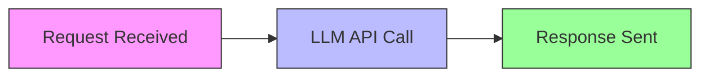

# LLM Communication Logging Improvement Plan

## Current State Analysis
- Basic console.log/error usage
- Inconsistent logging across components
- Missing key metrics and context
- No request tracing
- No structured format

## Key Improvements

### 1. Structured Logging
```typescript
interface LogEntry {
  timestamp: string;
  level: 'debug' | 'info' | 'warn' | 'error';
  correlationId: string;
  message: string;
  context?: Record<string, unknown>;
  durationMs?: number;
  tokenUsage?: number;
}
```

### 2. Request/Response Tracking
- Generate unique correlationId per request
- Log request/response payload sizes
- Track token usage and estimated cost
- Include user/session context

### 3. Performance Metrics


Metrics to capture:
- Total processing time
- LLM API latency
- Payload sizes
- Token counts

### 4. Error Handling Improvements
- Enhanced error context
- Safety filter details
- User-friendly error codes
- Retry logging

### 5. Log Levels
| Level   | Usage                          |
|---------|--------------------------------|
| debug   | Full payloads, dev only        |
| info    | Key metrics, operations        |
| warn    | Non-critical issues            |
| error   | Failures and critical problems |

### 6. Centralized Logger
Proposed logger interface:
```typescript
class Logger {
  log(level: LogLevel, message: string, context?: object): void;
  debug(message: string, context?: object): void;
  info(message: string, context?: object): void;
  warn(message: string, context?: object): void;
  error(message: string, context?: object): void;
  
  // Request-specific logging
  startRequest(correlationId: string): RequestLogger;
}

class RequestLogger {
  logPayload(payload: object): void;
  logResponse(response: object): void;
  endRequest(): void;
}
```

## Implementation Steps

1. Create `lib/logger.ts` utility
2. Update API route to use new logger
3. Modify chat component logging
4. Add performance monitoring
5. Configure log levels by environment
6. Add documentation for logging standards

## Expected Benefits
- Better debugging capabilities
- Performance monitoring
- Error diagnosis
- Usage analytics
- Consistent logging format