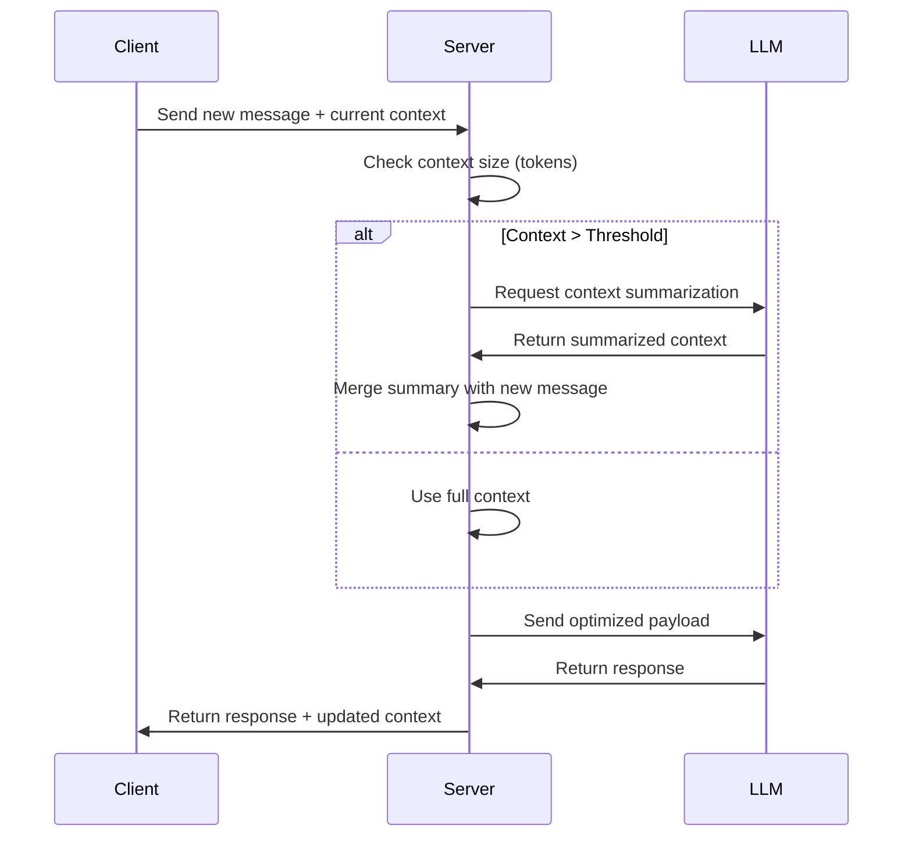

# Gemini LLM Context Optimization Plan (Updated)

## Current Issues Identified
1. **Full Context Resending**: Entire context object sent with each request (lines 146-152)
2. **No Token Management**: No token counting or limiting mechanism
3. **No Context Compression**: No summarization of previous interactions
4. **Inefficient Payload Structure**: Large JSON payloads with redundant data

## Implementation Strategy

### 1. Context Management System


### 2. Key Code Changes Required

1. **Token Counting Middleware**:
```typescript
// Add to route.ts
function countTokens(obj: any): number {
  const jsonString = JSON.stringify(obj);
  return Math.ceil(jsonString.length / 4); // Approximate token count
}
```

2. **Context Summarizer**:
```typescript
async function summarizeContext(context: LlmContext): Promise<LlmContext> {
  const summaryPrompt = `Summarize this learning context in under 100 tokens:
  Current Lesson: ${context.currentLesson?.data?.title}
  Mastered Concepts: ${context.conceptsMastered?.join(', ')}
  Recent Interactions: Last 2 messages`;
  
  // Call LLM for summary
  // Return compressed context
}
```

3. **Payload Optimization**:
```typescript
// Modify the parts construction (lines 113-153)
const parts = [
  { text: systemPromptText },
  { 
    text: `Current Context Summary: ${await getContextSummary(currentLlmContext)}`
  },
  { text: `User Message: ${currentUserMessage}` }
];
```

### 3. Expected Improvements

| Metric | Current | Target | Approach |
|--------|---------|--------|----------|
| Tokens/Request | 20,000 | 5,000 | Context summarization |
| Response Time | High | 30% faster | Smaller payloads |
| Context Retention | Poor | Full history | Summary + key points |

## Implementation Steps

1. Add token counting to validate payload size
2. Implement context summarization endpoint
3. Modify chat route to use summarized context
4. Add client-side context compression
5. Update logging to track token usage

## Verification Plan
1. Unit tests for token counting
2. Integration tests for context summarization
3. Load testing with reduced payloads
4. A/B testing for conversation quality