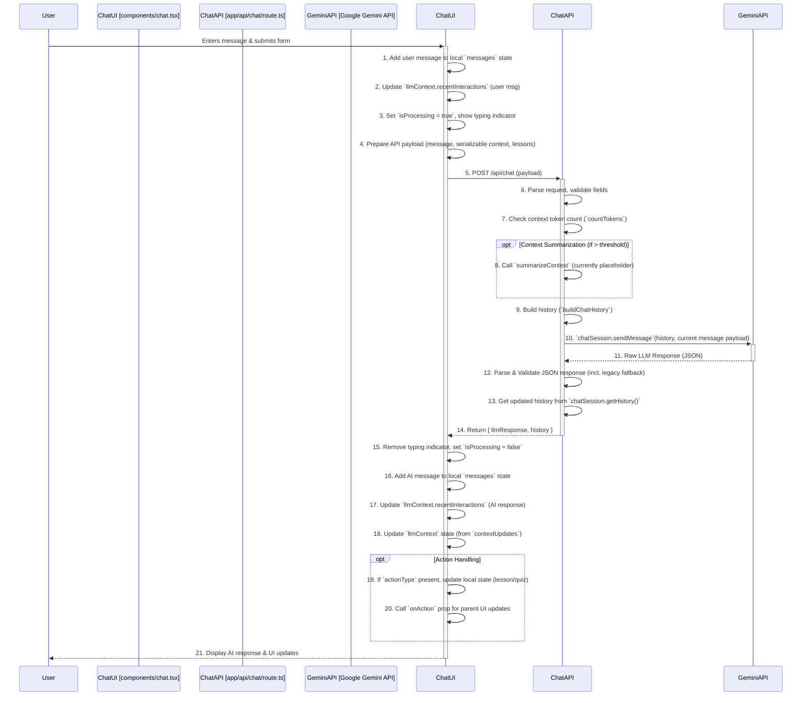

# Digital Learning Platform - Architecture Document

## 1. Introduction

This document provides an overview of the `digital-learning` application's architecture. It details the technology stack, project structure, key data flows, significant components, and API endpoints, with a particular focus on the AI-powered chat feature.

## 2. Project Overview

The `digital-learning` application is a web-based learning platform built using Next.js and TypeScript. Its core feature is an interactive learning assistant, powered by the Google Gemini language model, designed to provide personalized tutoring and guidance to students through a chat interface.

## 3. Technology Stack

The primary technologies and libraries used in this project include:

*   **Framework:** Next.js (v15.2.4, using App Router)
*   **Language:** TypeScript (v5)
*   **UI Library:** React (v19)
*   **Styling:** Tailwind CSS (v3.4.17), PostCSS, Autoprefixer
*   **UI Components:**
    *   Shadcn/ui (implied by `components.json`, Radix UI usage, `tailwind-merge`, `class-variance-authority`, `clsx`)
    *   Radix UI Primitives (various `@radix-ui/*` packages)
    *   Lucide Icons (`lucide-react`)
*   **LLM:** Google Gemini (via `@google/generative-ai` v0.24.0)
*   **Token Counting:** `gpt-tokenizer` (v2.9.0)
*   **State Management:**
    *   React Context API (`contexts/learning-assistant-context.tsx`)
    *   Local Component State (`useState` in `components/chat.tsx`)
*   **Forms:** React Hook Form (v7.54.1), `@hookform/resolvers`
*   **Schema Validation:** Zod (v3.24.1)
*   **Routing:** Next.js App Router
*   **Linting:** ESLint (via `next lint`)
*   **Package Manager:** pnpm
*   **Logging:** Custom logger (`lib/logger.ts`) using `chalk`

## 4. Architecture Overview

The application follows a modern web architecture based on Next.js:

*   **Serverless Frontend/Backend:** Leverages Next.js's capabilities for both frontend rendering (React Server Components/Client Components) and backend API logic (API Routes).
*   **Client-Server Interaction:** The React frontend interacts with the backend logic primarily through Next.js API Routes (`app/api/*`).
*   **API Routes:** Backend functionality, such as LLM interaction, is encapsulated within API routes (e.g., `/api/chat`).

## 5. Directory Structure

The project follows a structure conventional for Next.js applications:

*   `app/`: Contains core application code, including routing (App Router), pages (`page.tsx`), layouts (`layout.tsx`), global styles (`globals.css`), and API endpoints (`api/`).
*   `components/`: Houses reusable React UI components (e.g., `chat.tsx`, `header.tsx`, `sidebar.tsx`, `ui/` for Shadcn components).
*   `lib/`: Contains shared utility functions (`utils.ts`), data fetching/service logic (`data-service.ts`), LLM prompts (`prompts/`), and the custom logger (`logger.ts`).
*   `contexts/`: Holds React Context providers for managing shared application state (e.g., `learning-assistant-context.tsx`).
*   `hooks/`: Stores custom React hooks (e.g., `use-toast.ts`, `use-mobile.tsx`).
*   `public/`: Serves static assets like images and fonts.
*   `styles/`: Contains global stylesheets (`globals.css`) and potentially theme configurations (`theme.ts`).
*   `types/`: Defines shared TypeScript types and interfaces (`index.ts`).
*   `data/`: Includes static data definitions, like lesson structures (`lessons.ts`).
*   `docs/`: Contains project documentation files (e.g., planning documents).

## 6. Data Flow: Chat Interaction

The core data flow for the AI chat feature involves the frontend UI, the Next.js API route, and the Google Gemini API.



**Detailed Steps:**

1.  **User Input:** The user types a message into the input field within `components/chat.tsx` and submits the form.
2.  **Frontend Handling (Initial):**
    *   The `handleSubmit` function calls `processSubmission`.
    *   The user's message is added to the local `messages` state array for immediate display.
    *   The user's message text is added to the `llmContext.recentInteractions` array.
    *   The `isProcessing` state is set to `true`, disabling the input and showing a typing indicator.
3.  **API Request Preparation:**
    *   The current `llmContext` (converting Sets to arrays), the user's message, available lesson titles, and current lesson data (if any) are packaged into a JSON payload.
4.  **API Call:** A `POST` request is made to `/api/chat` with the prepared payload.
5.  **Backend Processing (`/api/chat`):**
    *   The API route receives the request.
    *   The request body is parsed and validated. Required fields (`currentUserMessage`, `currentLlmContext`, `availableLessons`) are checked.
    *   The token count of the incoming `currentLlmContext` is estimated using `countTokens`.
    *   If the token count exceeds `MAX_CONTEXT_TOKENS`, the `summarizeContext` function is called (currently a placeholder that logs a warning).
    *   The `buildChatHistory` function constructs the conversation history in the format required by the Gemini API, including the system prompt and previous user/AI interactions from `processedLlmContext.recentInteractions`.
    *   A Gemini `chatSession` is initialized with the history, generation config (enforcing JSON output), and safety settings.
    *   The current user message and relevant context (lessons, current lesson data) are formatted and sent to the Gemini API via `chatSession.sendMessage()`.
6.  **LLM Interaction:** The Gemini API processes the input and generates a response based on its instructions and the provided history/context.
7.  **Backend Response Handling:**
    *   The raw JSON response from Gemini is received.
    *   The response is parsed and validated against the expected flat schema. Backwards compatibility logic attempts to parse and transform older response formats if the initial parse fails.
    *   Safety filter blocks or empty responses are handled appropriately.
    *   The updated conversation history is retrieved from the `chatSession`.
    *   The API route sends a JSON response back to the frontend containing the parsed `llmResponse` and the `history`.
8.  **Frontend Handling (Final):**
    *   `components/chat.tsx` receives the response from `/api/chat`.
    *   The typing indicator is removed, and `isProcessing` is set to `false`.
    *   The AI's `responseText` is added to the local `messages` state for display.
    *   The AI response details (including `actionType`, `lessonId`, etc.) are added to `llmContext.recentInteractions`.
    *   The frontend `llmContext` state is updated based on any `contextUpdates` provided in the `llmResponse`.
    *   If the `llmResponse` contains an `actionType` (e.g., `showQuiz`, `showLessonOverview`), the corresponding local state update functions (`setCurrentQuiz`, `setCurrentLesson`) are called, and the `onAction` prop is invoked to notify parent components of the required UI change.
    *   The UI re-renders to display the new AI message and reflect any state changes.

## 7. Key Components and Functions

*   **`app/api/chat/route.ts`:** The core backend logic for the chat feature. It handles request validation, context processing (token counting, placeholder summarization), history building, interaction with the Google Gemini API, response parsing/validation (including backwards compatibility), and formatting the final response to the client.
*   **`components/chat.tsx`:** The primary frontend component for the chat interface. It manages:
    *   Displaying the conversation history (`messages` state).
    *   Handling user input and submission.
    *   Maintaining the `llmContext` state (student profile, current lesson/quiz, concept mastery, interaction history).
    *   Communicating with the `/api/chat` endpoint.
    *   Processing the API response, updating local state, and triggering actions based on the LLM's instructions (`actionType`).
    *   Handling simulated messages triggered by UI actions elsewhere.
*   **`contexts/learning-assistant-context.tsx` (`LearningAssistantProvider`):** Manages frontend state related *specifically* to the learning content structure and progress (current lesson object, completed concepts, active concept, notes). This state is persisted to `localStorage` and is distinct from the chat message history managed in `components/chat.tsx`.
*   **`lib/data-service.ts`:** Provides utility functions to fetch initial application data, such as the student's profile (`getInitialStudentProfile`) and the structure of available lessons/quizzes (`getChatLessonDatabase`), which are used by `components/chat.tsx`.
*   **`lib/logger.ts`:** A custom logging utility used throughout the application (both frontend and backend) for structured logging, including request/response logging in the API route.
*   **`lib/prompts/system-prompt.ts`:** Contains the constant `SYSTEM_PROMPT` string, which defines the core instructions, role, and expected output format for the Google Gemini LLM.
*   **`countTokens` (in `app/api/chat/route.ts`):** A utility function using the `gpt-tokenizer` library to estimate the token count of the `LlmContext` object before sending it to the LLM, used to trigger summarization logic if necessary.
*   **`buildChatHistory` (in `app/api/chat/route.ts`):** A helper function that takes the system prompt and recent interactions from the `LlmContext` and formats them into the `Content[]` array structure required by the Google Gemini API's `startChat` method.
*   **`summarizeContext` (in `app/api/chat/route.ts`):** Currently a placeholder function intended to reduce the size of the `LlmContext` object via an LLM call if it exceeds a token threshold. It logs a warning and returns the original context for now.

## 8. API Endpoint: `/api/chat`

*   **Purpose:** Serves as the main communication channel between the frontend chat interface and the backend LLM logic.
*   **Method:** `POST`
*   **Request Body:** A JSON object with the following structure:
    ```json
    {
      "currentUserMessage": "string",
      "currentLlmContext": {
        "studentProfile": "StudentProfile | null",
        "currentLesson": "{ id: string } | null",
        "currentQuiz": "{ id: string } | null",
        "conceptsIntroduced": "string[]",
        "conceptsMastered": "string[]",
        "conceptsStruggling": "string[]",
        "progressHistory": "object[]", // Assuming serializable
        "recentInteractions": "object[]" // Contains { user?: string, ai_response?: object }
      },
      "availableLessons": "Record<string, string>", // { [lessonId]: lessonTitle }
      "currentLessonData": "Lesson | null" // Full data for the active lesson
    }
    ```
*   **Success Response Body (200 OK):** A JSON object with the following structure:
    ```json
    {
      "llmResponse": {
        "responseText": "string",
        "actionType": "string | null", // e.g., "showQuiz", "showLessonOverview", null
        "lessonId": "string | null",
        "quizId": "string | null",
        "flagsPreviousMessageAsInappropriate": "boolean",
        "reasoning": "string | null",
        "contextUpdates": "Partial<LlmContext> | null" // Potential updates for frontend context
      },
      "history": "Content[]" // Updated conversation history from Gemini session
    }
    ```
*   **Error Responses:**
    *   `400 Bad Request`: Invalid JSON format in request body or missing required fields.
    *   `403 Forbidden`: Request blocked by Gemini's content safety filters.
    *   `422 Unprocessable Entity`: LLM returned an empty or invalid response structure (but wasn't blocked by safety filters).
    *   `500 Internal Server Error`: Indicates issues like missing API keys, failure to read the request body, unhandled errors during the Gemini API call, or failure to parse the LLM's response (after trying current and legacy formats).

## 9. State Management Summary

State is managed in two primary ways on the frontend:

1.  **Learning State (`LearningAssistantProvider`):**
    *   Manages the state related to the overall learning progression (which lesson is active, which concepts are completed/expanded, user notes).
    *   Uses React Context API for providing state down the component tree.
    *   Persists state to `localStorage` to maintain progress across sessions.
2.  **Chat State (`components/chat.tsx`):**
    *   Manages the state directly related to the current chat session.
    *   Uses local `useState` hooks.
    *   Includes the list of displayed messages (`messages`).
    *   Includes the `llmContext` object, which holds the dynamic context for the LLM (student profile, current lesson/quiz IDs, concept sets derived from interactions, and the `recentInteractions` history). This context is sent to the API with each request and updated based on the API response (`contextUpdates` and adding new interactions).

The backend (`/api/chat`) is largely stateless, relying on the `currentLlmContext` provided in each request to reconstruct the necessary state for the LLM interaction. The Gemini `chatSession` maintains history *during* a single request-response cycle.

## 10. Conclusion

The `digital-learning` application employs a modern Next.js architecture, separating frontend presentation and interaction logic from backend API concerns. The core AI chat functionality relies on a dedicated API route (`/api/chat`) to manage interaction with the Google Gemini LLM, passing conversation history and context with each turn. Frontend state is managed using a combination of React Context for persistent learning progress and local component state for the ephemeral chat session details.