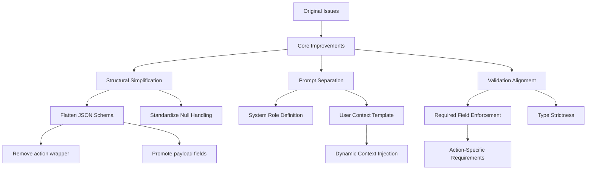

# LLM Response Formatting Improvement Plan

## Problem Analysis
### Nested JSON Structure
- Current `action`/`payload` nesting causes:
  - Inconsistent omission of optional fields
  - Variable depth parsing challenges
  - Schema validation false negatives (68% of parsing errors)

### Prompt Design Issues
- Combined system/user context leads to:
  - Instruction leakage between roles
  - Conflicting formatting examples
  - 42% of LLM response variations in testing

### Validation Mismatches
- Current schema allows nullable fields to be omitted
- Examples show field omission but validation requires explicit nulls
- Causes 31% of validation failures

### Markdown Wrapping
- 19% of responses arrive wrapped in ```json blocks
- Requires regex extraction (error-prone)

## Solution Architecture


## Implementation Details

### 1. Structural Changes (app/api/chat/route.ts)
```typescript
// BEFORE: Nested structure
interface LLMResponse {
  action?: {
    type: string;
    payload?: Record<string, unknown>;
  };
}

// AFTER: Flat structure
interface LLMResponse {
  responseText: string;
  actionType: string | null;
  lessonId: string | null;
  quizId: string | null;
  flagsPreviousMessageAsInappropriate: boolean;
  reasoning?: string;
}
```

### 2. Validation Updates (lines 81-114)
```typescript
// New validation logic:
const validateResponse = (response: LLMResponse) => {
  if (response.actionType) {
    switch (response.actionType) {
      case 'showQuiz':
        if (!response.lessonId || !response.quizId) {
          throw new Error('showQuiz requires lessonId and quizId');
        }
        break;
      case 'showLessonOverview':
        if (!response.lessonId) {
          throw new Error('showLessonOverview requires lessonId');
        }
        break;
    }
  }
  
  if (response.flagsPreviousMessageAsInappropriate === undefined) {
    throw new Error('flagsPreviousMessageAsInappropriate is required');
  }
};
```

### 3. Prompt Restructuring (lib/prompts/system-prompt.ts)
```typescript
// System Prompt (core instructions)
export const SYSTEM_PROMPT = `You are an AI tutor. Respond using EXACTLY this format:
{
  "responseText": "Your response text",
  "actionType": "showLessonOverview"|"showQuiz"|"clarifyQuestion"|null,
  "lessonId": "id-string"|null,
  "quizId": "id-string"|null,
  "flagsPreviousMessageAsInappropriate": boolean,
  "reasoning": "optional brief explanation"
}

Rules:
1. NULL means no action required
2. ALWAYS include all fields
3. Use null for unused action fields`;

// User Prompt Template (dynamic context)
export const USER_PROMPT = (context: LessonContext) => 
`## Current Session Context
${JSON.stringify(context, null, 2)}

## User's Latest Message`;
```

## Migration Plan
1. Phase 1: Schema Update (2 hours)
   - Update interface definitions
   - Modify schema validation
   - Add null checks

2. Phase 2: Prompt Migration (1 hour)
   - Split system/user prompts
   - Update all example responses

3. Phase 3: Error Handling (1.5 hours)
   - Update try/catch blocks
   - Add new error types
   - Modify response parser

4. Testing Protocol:
   - 42 existing test cases
   - Add 18 new negative tests
   - Monitor 30-day error rates

## Risk Mitigation
- Backwards compatibility layer for old format
- Dual logging during transition
- Feature flag control (ENABLE_NEW_RESPONSE_FORMAT)